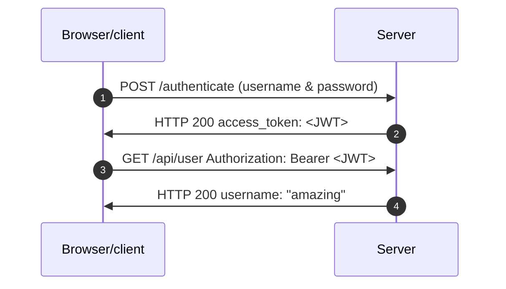

## Digital Certificates

Used to verify the server's ownership prior to sending encrypted data. 

Just like a physical certificate you might sign (e.g. car registration), the digital signature of this digital certificate is valid and we trust the person who issued this TLS certificate, then we say, ok, I'm willing to use th ekey that this server sent to send encrypted data back and forth with that server. This is used to verify that we're actually talking to the server that we expect. I mean what difference does it make if we're sending encrypted data if it's going to the wrong person!! The secret is out lol.  This is known as a 'man in the middle' attack if that happens. 

## Certificate Authority aka CA

A trusted organization that issues digital certificates.

This is an organization that your computer or your browser already trusts to issue a valid digital certificates that actually verify the real server's owner and aren't just created by some malicious hacker. 

In the early days we had to buy these certificates from 'Certificate Authorities' that would potentially cost 100s of dollars. But lucky for us, there's now certificate authorites that allow us to sign these certificates for free! 

One of the most well known CA's is 'Let's Encrypt' which are backed by Google, Facebook and all kinds of other giant companies to provide you with the same security w/out the added cost. However, Let's Encrypt will only give you a certificate if you meet certain conditions. For example, your site needs to have a domain name and can't just be an IP address on some server somewhere. This is why we have a type of certificate called a 'self signed certificate' that still allow sus to encrypt our traffic and use HTTPS, but we sign it ourselves on our local machine and our local machine our cert is not trusted by others. It's used for development 

Use openssl to create our self signed certs:
```
openssl req -x509 -newkey rsa:4096 -nodes -keyout key.pem -out cert.pem -days 365
```

2 files will get created: key.pem and cert.pem since that's what we called them i the command. The key.pem is private and ensures we're the only one  whose encrypting data for this server. So ownership of the private key, key.pem,  means we are the ones encrypting data for owner identified by cert.pem. The cert.pem is the public key and that is used to identify us/the owner of the cert/server.

### Authentication vs. Authorization

Authorization is sometimes called 'access control' Sometimes Authentication and Authorization is combined to be called 'auth' Since they both start with 'auth'

Note the http 401 Unauthorized error is wrong. It says 'unauthorized' when it means 'unauthenticated' and we have 403 for authorization aka permissions. 

### API Keys

There are three main tools that developers use to make sure that only authorised users can access a server and its API.

1. Sometimes we restrict access to our API with what's known as an API key.
2. Sometimes we use both tokens and 
3. sometimes we use what's called JSON Web Tokens or JWT.


Let's start by discussing API keys and API key is a string value that we use for two purposes.
The `first` is as a unique identifier for your project, for your application, so that the server you're
making a request do from your application knows which application that request came from.
And the `second` purpose of API keys is to grant and restrict access to some API. API keys are usually
used when the users of your API are developers trying to enable some functionality in their application
that makes use of the features that you've already exposed in your API.

Sometimes these API keys are public. That is, anyone can view the API key for some application.

For example, if I go to the Starbucks store locator here. And I'm looking up all of the stores in Vancouver, Canada. I can go to the source code for this page. And if I search, key equals.
I get it results with this boomer API key and check it out.I have the value right there.

API keys are often public when they're just used, only to identify which app is using this API.
For example, in this case, this boomer API is being used for real user monitoring.

It's tracking the users of this Starbucks application and is mostly being used to identify that requests
to this boomerang API are coming from the Starbucks app or the Starbucks website.

But usually you want to keep API keys private by making sure that they're available only in the server.  On the server side and not in your front end JavaScript, like we see with the Starbucks site, we normally use these API keys when an API is designed to be public or easily accessible.

But the owners of that API of that server still want to make sure that the API won't be abused.
Normally, we associate each API request with an API key, bypassing in that API key as either a query
parameter or as a header in that HTTP request.

Now, with each API request being associated with some API key. If, for example, too many requests come in too quickly from one API key. 

What can the server do? Well, if that server wants to limit the amount of requests that are allowed per API key per minute, that API, that server might send a 429 too many requests response, which indicates that the user has sent too many requests in some given amount of time. 
This is what's called rate limiting, and it's a great idea when you have an API that's exposed to the
public. You want to make sure that your API is accessible to everyone and that a few users aren't overloading your API with millions of requests per hour, which can cause your server to become unavailable to all those other users or in some other cases, the owners of an API might suggest that you upgrade to a higher tier that might c

One example of a platform that uses API keys is Google Maps and the Google Maps API, say you wanted
to display a map on your website with all the different locations of your coffee shop.
You'd request Google Maps to display that map of coffee shops with some API key attached when you load
the JavaScript to show the map. You would include the API key as a query parameter in your request to load that JavaScript.

This is a tool that Google uses to make sure you're not overloading their API with too many requests.

How do we get one of these Google keys?

Well, we can go to the Google Cloud platform with our Google account, and we might need to create
a project. 

E.g. To create an API key for your application that, say, may want to use google maps, you can go to the google cloud. You may need to create a project, go to library and create credentials to get your API Key. Worth noting are the restrictions section to ensure your API key that google issues you won't be abused e.g. 'using http referer' and adding your site's address to ensure that the API key you requested, will only be used by your website. Follow the least privilegdges model and only give your API Key minimal permissions. 

Sometimes we want a more granular set of permissions w/our API keys. This is where JWT Tokens come into play IMU.

### JWT Tokens - JSON Web Tokens

JSON web tokens also known as 'jw tees' are a type of access token. Access tokens are much like API keys. They uniquey identify a specific user of an application. But more than that, they act as a set of credentials for that user to grant access to an API. 
<script>
  mermaid.initialize({ sequence: { showSequenceNumbers: true } });
</script>


This flow is what's known as token based authentication, which is sometimes also known as `bearer authentication`. Because the person bearing that token is the bearer. 
We pass them in as a header in our request where the name of the header is `Authorization:Bearer <JWT>` includes the word 'bearer', followed by your access token. 

Thw two most common types of tokens are `Opaque` tokens and `JWT` tokens.  `JWT` tokens follow the JWT standard. That standard tells API developers how to decode these tokens so that we can validate that token before trusting it, to respond to some requests, and to verify that the correct permissions have been granted to that token.

The other type of token is the `Opaque` token. Where it follows some format that' s not understood by the server to validate this kind of token. Our API will usually make a request against another server somewhere that server, which issued the token in the first place, the server that created it. But JTees are nice because they don't require this additional request, and they can be extended with any addiional functionlaity that your server needs. 

Just like a passport can be customized to include different type sof data, a JWT can also be customized. Recall JWT doesn't have to be just authentication credentials. It can include diff types of additional data. 

The token can only be encoded with a valid signature by the server, which has the secret used in the signature. But it's important to understand that JWT tokens are encoded and signed with their signature, but not encrypted. 
Anyone can copy/paste a jwt token, decode and get the information contained within it. 

The signature here only prevents the manipulation of existing tokens or the creation of fake credentials of fake tokens by malicious users who are trying to get access to our data where, for example, I replace a name 'john doe' with name 'Robert the robber' Only the server with the secret used in the JWT signature will be able toc reate new, valid tokens  and tchange the name in our payload. The token can't be tampered with, but it can be publicvly read by anyone who gets access to that token. 

Because of this, JWT is on the secure network communication that https. So `jwt` only works under https otherwise not secure IMU. Payload is an optional field IMU, that are part of the jwt standard.Every piece of information is considered a `claim` and thus is an assertion of truthfulness.  

The "sub" tells you who this token carres information about. hence the subject. It's usually a hash or unique user id. So ea. claim in the payload is about the subject/sub. 'iat' is short for 'issued at this time'. You can add expiration fields etc.. We can keep adding information about our subject into these tokens and have access to it directly w/out needing to look up that data in some other database.

Its good to keep it succinct and not add too much. Afterall, we will be sending this token back and forth... The purpose is to grant access to our subject so that they can use our API. 

