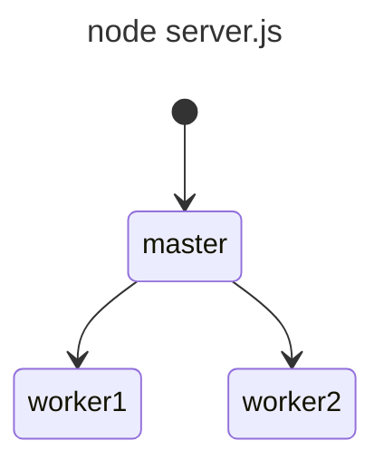

As with typical node applications, we'll be using MVC. 

It is customary to group code w/similar functionality together. It is for that reason controllers is NOT in the server folder.
It's also common to have multiple packages i.e. multiple package.json like we will in this project.

D:.
├───client
|
└───server
    ├───models
    └───routes

So we have a package.json in the clients folder, server folder and the main root folder. The package.json in the main root folder will control (i.e. start/stop) the packages in the client and server folders. This way we can run commands against our client & server folders. Now, we will create & populate these files the right way using package.json

Create React App is a great way to start react if your new to it IMU.  This is a tool to quickly create react app applications.
It simplifies our life by bundling our files together so they can be sent directly to any browser w/out us developers having to take any extra steps.

so open up zip file and copy contents to client folder, cd client; npm install

`npm start`  # will start on port 3000 in the browser.

## Notes on the React code from Nasa

If we go to our app layout dogs and we scroll just above our return statements where we return, all of these components will see a couple of these use functions, like use launches and use planets.

These are hooks. Which are reacts way of responding to events that occur in your application and managing the resulting state of your application. With hooks, you take the states that would live in your react components. These things, like the header and the footer, or any buttons or forms that your application is composed of. And you move this state into these hooks instead, which simplify how you pass this state, like the list of planets. Around between your different components, which we can see, for example, the list of planets being passed in to our launch page because they're required for that drop down.
So you capture this state in the hooks and you also save react from RE rendering your application needlessly
because react can keep track of exactly what state has changed versus what state hasn't changed. And only render the things that have changed.

These hooks simply how you pass state. 

All of these hooks. Are really just making sure that our application state is saved and any calculations or API requests needed for that state are only performed when the user performs some action that will cause an update. For example, our launches data won't be reloaded every time we switch pages because nothing has changed.
Hooks are great for making our react applications more efficient and minimizing the amount of requests that are API needs to handle which speeds everything up.

Everybody wins. Now lets setup the API

### API Server Setup

`cd server`
`npm init -y`
For convenience, we'll use nodemon and make it dev dependency ONLY i.e. won't ship with production! 
`npm install  --save-dev nodemon`
mkdir src inside of server folder to mimick the client folder code that Nasa has.
mv server.js,model & routes folder to like so:

NASA-PRJ
└───src
    ├───models
    └───routes


modify package.json to point to new location. E.g.

"watch": "nodemon src/server.js"

Recall our frontend React runs on port 3000 by default, so it helps us if we runour backend server on a different port, say 8000. We could specify an env variable like so
Package.json:

if using windows:

  "start": "set PORT=5000&& node src/server.js"
Note: cross-env NPM can handle any OS if interested.

Note express's app.listen is the same as http.listen. We can use either of them. 

### Building for production

Most/all frameworks will have a build script to build for production. If we're using plain old java script, for our front-end, we don't need to worry about this.  We can just serve those files directly.

Ideally, we'd like to run both client & server from the same location. As of now they run on two differnet ports on two different directories. 

`cd client`
`npm run build`

Note this will create a build directory at client/build
We don't want the build directory/folder to live under the client directory. We can automically setup our client to copy this folder into our server. 
To do this, in package.json add the following line to scripts section.
For windows:

"scripts": {
  "build": "set BUILD_PATH=../server/public&& react-scripts build",
}

Now we have to let our API server know we'll be serving the react client by going into app.js and doing:

app.use(express.static((path.join(__dirname,'..','public')))); // Serve static files from the 'public' directory


### Logging Requests wtih Morgan

Of course we can write our own use the req.url etc...but Morgan has a lot of good features according to Udemy such as log rotation. 


https://www.npmjs.com/package/morgan

Apache style:

:remote-addr - :remote-user [:date[clf]] ":method :url HTTP/:http-version" :status :res[content-length]

Dev:

:method :url :status :response-time ms - :res[content-length]

Minimal:

:method :url :status :res[content-length] - :response-time ms

Install: `npm install morgan`


### Launch Model

const launch = {
  flightNumber: 100,
  mission: 'Kepler Exploration X',
  rocket: 'Explorer IS1',
  launchDate: new Date('December 22, 2040'),
  destination: 'Kepler-442 b',
  customer: ['ZTM','NASA'],
  upcoming:true,
  success:true,
}
#### Java maps
To store launches we will use java maps. They are more flexible than java objects because they can store stuff like:
{
  ()=> {}: '',
  1234: 'launch number'
}

They also preserve the order you insert things which is not guaranteed w/ordinary java objects. 

const launches = new Map();
// key = flightNumer, value = launch
launches.set(launch.flightNumber, launch)
launches.get(100) === launch

## install pm2 for clustering

cd server; npm i pm2

Edit package.json and we should look something like:

  "scripts": {
    "test": "echo \"Error: no test specified\" && exit 1",
    "start": "node src/server.js",
    "watch": "nodemon src/server.js",
    "cluster": "pm2 start src/server.js -i max"
  },

Important: Now when you create a launch and go check to see if it was created, you may not see it in the history! The reason is we are using new Map()
which is making it seems we are not saving our launches because it stores it in the memory of our node process. Because we have multiple node processes in our cluster, in so the launches are stored in one of the node processes memory but when you subsequently run a get request for launches, you are likely getting it from a node process the launch was NOT created on thus not seeing the launch!!


The solution is to remove state from the node processes and use a database.

## Threads

Worker threads module enables the use of threads that execute JS in parallel. Workers (threads) are useful for performing CPU-intensive JS operations. They don't help much with I/O intensive work. The NOdeJS built-in async I/O operations are more efficient than Works can be.

But doesn't our JS code work on a single thread? Is what we learned wrong? Everything we learned still very much applies. Worker threads don't change how Node works at the core but they do add something new. Worker threads take node one step closer to being multi-threaded but not exactly. 

So whats the diff between worker threads and traditional multi-threading? Worker threads are based on the 'Web workers' that are available in the browser with the web worker API. Web workers let you run a piece of JS code  in your browser in a worker thread. This is still evolving.

Thanks to V8 Isolates, which are isolated instances of the V8 engine. We can think of them as sandboxes that run JS code independent of ea. other. Worker threads use these isolates to create new threads that can execute our JS code side by side w/ea. V8 isolate handling the JS code for one thread. 

In practice that means worker threads allows us to take advantage of the multiple CPU processors in our machine. So worker threads are similar to the cluster module but do things very differently.  Cluster module uses processes and worker threads use this V8 isolate thingy. 

How does this impact us as developers? Lets look at the difference.



<font size="6" color="lightblue">Compared to the worker thread module</font>

```mermaid
---
title: node index.js
---
stateDiagram-v2
  state "main thread" as mt
  state "worker thread" as w1
  state "worker thread" as w2

  [*] --> mt
  mt --> w1: new worker()
  mt --> w2: new worker()
  ```

Basically, you can think of the cluster module as allowing us to run multiple instances of node in separate processes, while the worker thread module allows us to run multiple instances of node in the same process.

By taking advantage of that V8 isolate feature that we mentioned, we'll see this whole flow in action when we write some code to take advantage of worker threads.There's also some very important functional differences between worker threads and clusters.

If you're paying really close attention, you might have noticed that with the worker thread example, I'm not calling my JavaScript file server.js, but instead index.js.

This is to highlight the difference that each worker thread here is not designed to share requests coming=
into a server. The worker threads module doesn't include any built in functionality to run a server on one port and distribute incoming requests between each thread.

That's specific to the cluster module. So we could run a server using worker threads, but we'd have to implement that distribution of work

ourselves.

And here's the main difference.

**Unlike processes made with the cluster module, worker threads can share memory between each other.**  

For now, what we need to know is that the worker thread approach isn't as rock solid as the cluster approach with multiple processes.

This cluster approach, which has been used in node since pretty much the day that it was created. **In production, I highly recommend you stick with clustering for your servers.**

But that's what makes worker threads so exciting. There's still a lot of potential behind how they can be used. Its definately an area to watch out for!


## Worker threads In Action
E.g.
new Worker(__filename)

And as it stands, this code would create workers over and over until our machine can no longer create workers, right, because we would run our program. It would create workers that run our program again, which just create more workers forever.

So what we want to do is only create new workers if we're in the main thread. When we run threads dogs for the first time, so we can check is main thread and only then call `new Worker()`  