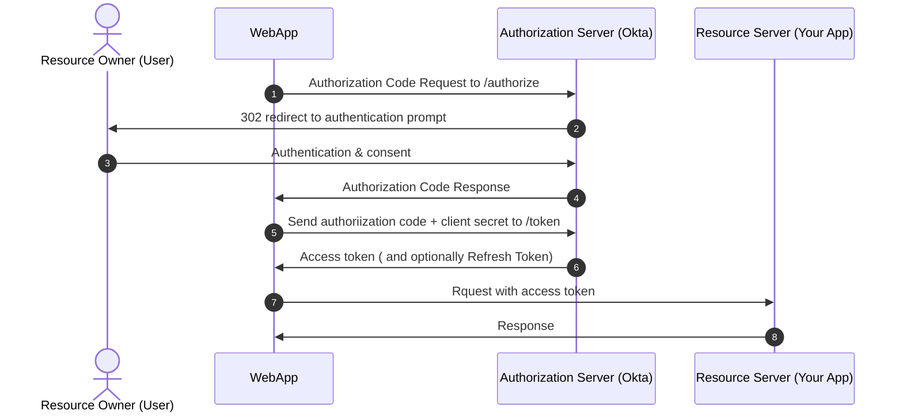

# OAuth Standard

This was important enough it has its own note file.

One of the most widely used approaches in implementing login, used by everything from Google to Facebook to Github. 

OAuth defines the flow or process that goes on behind the scenes when you logon to a site like google. This flow isn't the simplest for developers.

OAuth 2.0 Flow 'Authorization Code Flow'


If you ever wanted to remove a website from having access to your oauth (i.e. google or whatever) account. You an log into your google account (if google) and revoke access to the website that used google to log you in. Medium in the case of this lecture. 

In action via Dev Tools/Network tab using medium.com. Clicked on signin with google and viewing devtools:

1. google?state=google-%7https... click on that request in DT (devtools)
and view Headers and find:
```
Request URL: https://medium.com/m/connect/google?state=google-%7Chttps%3A%2F%2Fmedium.com%2F%3Fsource%3Dlogin--------------------------lo_home_nav------------------%7Clogin&source=login--------------------------lo_home_nav------------------

Responded w/
Status Code: 302 Found

and redirected us to:
Location: https://accounts.google.com/o/oauth2/auth?operation=login&state=google-%7Chttps%3A%2F%2Fmedium.com%2F%3Fsource%3Dlogin--------------------------lo_home_nav------------------%7Clogin&access_type=online&client_id=216296035834-k1k6qe060s2tp2a2jam4ljdcms00sttg.apps.googleusercontent.com&redirect_uri=https%3A%2F%2Fmedium.com%2Fm%2Fcallback%2Fgoogle&response_type=id_token%20token&scope=email%20openid%20profile&nonce=cb897c738870367d2518fb0984c86c9dacf599a4e302ad6af7aceb7121757aba

```

2. Look at the url you were redirected to defined by `Location` above and 
click on that
```
Request URL: https://accounts.google.com/o/oauth2/auth?operation=login&state=google-%7Chttps%3A%2F%2Fmedium.com%2F%3Fsource%3Dlogin--------------------------lo_home_nav------------------%7Clogin&access_type=online&client_id=216296035834-k1k6qe060s2tp2a2jam4ljdcms00sttg.apps.googleusercontent.com&redirect_uri=https%3A%2F%2Fmedium.com%2Fm%2Fcallback%2Fgoogle&response_type=id_token%20token&scope=email%20openid%20profile&nonce=cb897c738870367d2518fb0984c86c9dacf599a4e302ad6af7aceb7121757aba

Status Code: 200 ok
```

Teasing apart the request to glean the important elements

```auth?operation=login
state=google-%7...
client_id=Our apps client id
redirect_uri (also known as callback i.e. where to go AFTER user authenticated  and is a way of 'calling back'): https%3A%2F%2Fmedium.com%2Fm%2Fcallback%2Fgoogle&response_type=id_token%20tok...

scope=email etc...
openid
```
response_type=id_token (it was code in the lecture) is a way of telling google we are using this flow (code flow) and that we expect to receive in response this code so that our callback when its handled by our server by medium.com/callback/authenticate can continue with the next steps of our flow. Whats key is that we'll be getting back this code in the callback once the user logs in. 
OpenID is built off of oAuth and is more opionated in exactly how you follow that flow, because an OpenID is more specific in which data is being passed around. 

You will also find cookies set for youtube and other google sites. One of the beneifts of oAuth is when i signed into medium using Google, google set cookies for youtube etc..So all sites owned by the auth server, google, i'm now able to log into even though i only intended to log into just medium.com

This deviated a little from the lecture. need to do this in real time once i develop OAuth myself.

## Registering w/Google Authorization Server

1. Google 'oauth google'
2. Find the 'Google API Console' link and click
3. Created new project 'NASA Node App'
4. Select 'NASA Node App' project
5. Credentials (should be on left side)
6. + Create Credentials (should be on top)- Select 'OAuth Client Id'
    which identifies our app to google.
7. Configure Consent Screen (google needs to know what name to display)
8. Add Scope under 'Data Access' selected only userinfo.email
9. Audience (on left) and publish app
10. Clients 
    - 
        + Create client::
        Applciation type= Web Application
        Name=NASA Salad
    Authorized JavaScript Origins (important)
    
        + Add URI
            https://localhost:8100
        + Authorized redirect URIs
            https://localhost:8100/auth/google/callback


### Authentication Protecting End Points

we're going to protect the secret end point so that only authorized users can access
the data that it provides normally when we want to protect our end points, when we want to restrict access to them to only logged in users, for example, we do this in middleware that runs BEFORE our request handler has a chance to send that data back.

Just like the helmet, middleware helps protect all of the end points that come after it. If we wanted to restrict access to all of the end points in our API, well, we would add an apt use with some middleware.

So that's a function that takes requests, response and a next function.
And in this function, we would return an error code, maybe 401 if the user is not logged in or 403 if they don't have the right permissions.

And if all of our checks that the current user has access to our API pass, then we'll just call next and allow the request handlers for the appropriate end point to run.

IMW:
The issue is what about the endpoints that come after our secure end points? They would never get accessed if the user is not logged in!! We want to protect ONLY the secure end points while letting past those endpoints people who we consider public or safe to access endpoints that are not intended to be secure.

In `express` and similar frameworks, you can pass in middleware for ea. endpoint invidually when you define the route. So if u had two functions defined for doing some securitychecks. E.g.

app.get('/secret',checkLoggedIn,checkPermissions, (req,res) => {
// code here...
})

This is how we restrict access in Express. This is how we do authorization in Express!

Now we should probably code an endpoint for our user to log in! 😄  Logout is also a must have and the way we log out has nothing to do with google or any provider for that matter so this function can be generic. 

We will use `passport` the npm package for authentication. It covers hundreds of diff approaches to authentication. The beauty is provides a common way e.g.
```
passport.authenticate('google');
passport.authenticate('facebook');
passport.authenticate('linkedin');
```

These different methods i.e. 'google','github' etc.. are called 'strategies'. 

We used the most commonly used verion when it comes to google strategy:
`$ npm install passport-google-oauth20`
and of course we need passport. Order of install doesnt matter
`npm install passport`

And to store our secrets:
```
npm install dotenv
```

What does our web app need to do?

Well, it needs to kick off the overflow with this authorize request to /auth, and then it needs to handle the authorization code response that comes into our callback URL.

As a redirect, it needs to send that authorization code and this client's secret to some end point in Google, which will give us back an access token, which is finally what our app needs and what can be associated with a user when they try to access some protected resource in our application.

Here IMW what happens:
1. I'm on the webapp and i want to access somthing so the webapp sends an auth request to /auth (or whatever uri)
2. Auth server receives req from step #1 and says ok, send your user over here to this url for login authentication 
3. User logs in and authenticates and gives consent that he/she indeeds want that resource
// 4, 5 & 6 are handled by the callback end point!
4.  kk Auth servers says here is your auth code ( i think this defines what flow to use). i believe this is sent in the callback url.
5. Web app now knows, based on auth code, that we will be using 'authorization code flow' and sends back the auth code and client secret to ensure the auth server that the webapp is who it says it is and sends it to /token (or whatever uri is defined)
6. Auth Server says ok, user is who they say they are and you are (webapp) is who you say you are, here is your access token.
7. user now sends request to the original resource user wanted in the first place and sends the acces token
8. Resource server sends back resource

```
const AUTH_OPTIONS = {
    callbackURL: '/auth/google/callback',
    clientId: config.CLIENT_ID,
    clientSecret: config.CLIENT_SECRET
}
function verifyCallback(accessToken, refreshToken, profile, done) {
    console.log('Google profile',profile, 'access token: ',accessToken);

    // if the credentials are valid, call done. if something goes wrong, we can pass an error
    // we are passing in null. the user data is just the profile
    done(null,profile); //passport knows u are logged in now
}
passport.use(new Strategy(AUTH_OPTIONS),  )
app.use(passport.initialize())
function checkLoggedIn(erq, res, next) {
    const isLoggedIn = true; //Todo
    if (!isLoggedIn) {
        return res.stats(401).json({
            error: 'You must be logged in'
        })
    }
    next();
}

// login w/ identity provider google
app.get('/auth/google',(req,res) => {

})

app.get('/auth/google/callback',(req,res) => {
    
})
```

Now you might be asking, what's the point of this verify callback if we're just passing back this profile object that was already passed in to verify callback?

Isn't this just passing our data straight through? IOW:
function verifycallback(accesstoken,refreshtoken,profile,done) {
    ... are we just receiving it in this cb and sending it back via done()? once the point of 
    receiving it if all we're going to do is pass it back!? That is what is meant by the question
    above. But if it were a password, we could potentially compare that to one in a database or something. For us , now, it's an accesstoken so user has already been authenticated.
    done(null,profile); 
}


Well, with oAuth, if we've received an access token, we know that the credentials for that user are valid.
Google has already checked that for us, but if we were checking passwords ourselves, the user's password is what would come into this verify callback and this function is where we could compare the user's password against some value in our database and decide whether the credentials that are being passed in are valid or not.

As an added bonus, if we are using a database, we can also use this verify callback function to save the user that's come back, as well as any of their profile information into our database so that it's available in the rest of our application.

The verify function is responsible for wrapping up the authentication process. It just so happens that with OAuth, most of the heavy lifting has already been done.