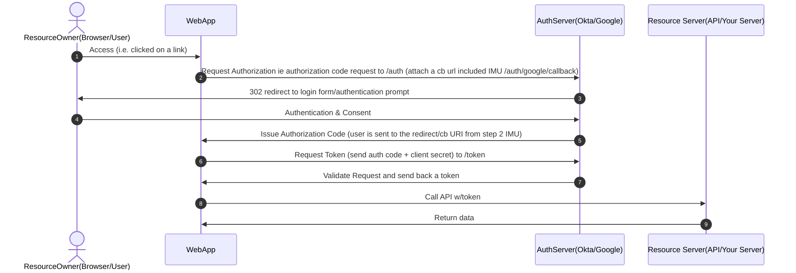

# OAuth 2 Authorization Code Flow (maybe id_token ; need research)
The most widely used as of this writing.

```mermaid
sequenceDiagram
    autonumber
    actor ResourceOwner(Browser/User)
    participant WebApp
    participant AuthServer(Okta/Google)
    participant Resource Server(API/Your Server)

    ResourceOwner(Browser/User)->>WebApp:Access (i.e. clicked on a link)
    WebApp->>AuthServer(Okta/Google): Request Authorization ie authorization code request to /auth (attach a cb url included IMU /auth/google/callback)
    AuthServer(Okta/Google)->>ResourceOwner(Browser/User):302 redirect to login form/authentication prompt
    ResourceOwner(Browser/User)->>AuthServer(Okta/Google): Authentication & Consent
    AuthServer(Okta/Google)->>WebApp: Issue Authorization Code (user is sent to the redirect/cb URI from step 2 IMU)
    WebApp->>AuthServer(Okta/Google): Request Token (send auth code + client secret) to /token
    AuthServer(Okta/Google)->>WebApp: Validate Request and send back a token
    WebApp->>Resource Server(API/Your Server): Call API w/token
    Resource Server(API/Your Server)->>WebApp: Return data
```

